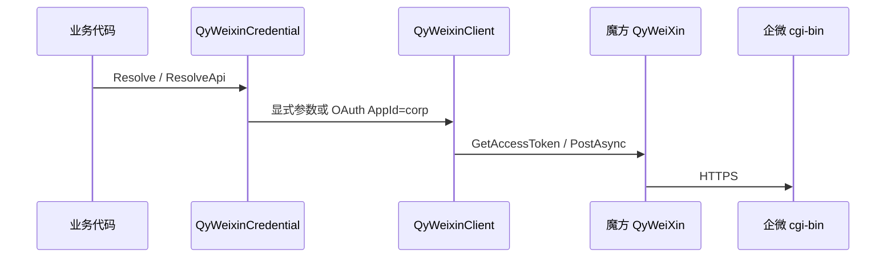

# NewLife.Cube.QyWeixin 架构设计

> 版本：v1.1 | 日期：2026-10-05
> 需求对应：[需求文档](需求文档.md) | 功能清单：[功能清单](功能清单.md)

## 1. 整体架构

类库只有一个程序集 `NewLife.Cube.QyWeixin`，目标框架 net8.0。所有要打 `qyapi.weixin.qq.com` 的调用都从魔方 `QyWeiXin` 派生，使用其 `GetAsync` / `PostAsync` / `GetQyClient` / `GetAccessToken`。二进制素材走 `GetQyClient()` 的 `HttpClient`，因为基类的 Get/Post 会把响应当 JSON 拆。

回调是另一条路：`QyWeixinCallbackController` 用 `QyWeixinCrypt` 验签解密，再交给 `QyWeixinCallbackDispatch`。处理器不直接写 HTTP。

## 2. 组件

| 组件 | 所在工程 | 说明 |
|------|----------|------|
| `QyWeixinClient` | 本库 | 自建应用 API。`QyWeiXinSender` 只保留历史类型名 |
| `QyWeixinAppMessage` | 本库 | message/send 请求体。历史 text 不输出空 totag |
| `QyWeixinCrypt` | 本库 | WXBizMsgCrypt。被动回复与 echostr 拆包 |
| `QyWeixinCallbackDispatch` | 本库 | 先结构化处理器，未消费再走旧 `HandleAsync` |
| `QyWeixinOAuth` | 本库 | 授权 URL。`BuildLikeCube` 调用魔方 Init + Authorize |
| `QyWeixinJsSignature` | 本库 | SHA1 签名。返回值不含 ticket |
| `QyWeixinCredential` | 本库 | 显式参数优先于 OAuth |
| `QyWeixinService` | 本库 | 只读 Cron。`PullMode` 决定是否覆盖本地已有行 |

## 3. 关键流程

### 3.1 凭据

`QyWeixinCredential.Resolve` 先看 `QyWeixinOptions` 的 CorpID + Secret，否则查租户 0 下启用的 OAuth（Provider=QyWeiXin，或名称含「企业微信」）。AppId 的 `corp#agent` 由魔方 `Init` 拆开。发消息还要求能得到 AgentId。

### 3.2 回调回复

用户消息的处理器返回明文 XML。端点调用 `BuildEncryptedReply`，receiveid 用 OAuth AppId 的企业 ID。事件仍回空串。处理异常只记日志，避免企微按 4xx 重推。

### 3.3 通讯录两条路

写接口只 POST/GET 企微。同步作业只 `GetDepartments` / `GetUsers` 再写入魔方 `Department`/`User`。`Upsert`（默认）用企微覆盖本地映射字段；`InsertOnly` 遇到已有 Code/Name 则跳过更新。作业代码路径里没有创建部门、创建成员等写方法。

## 4. 设计决策

| 决策 | 选项 | 选择 | 理由 |
|------|------|------|------|
| API 放哪 | 改 Cube 源码 / 本库派生 | 本库派生 | 任务要求不改 Cube.Core |
| 消息入口 | 改掉三个旧方法的返回值 / 保留 Task 并新增 SendMessageAsync | 保留签名 | 已有告警推送在用旧签名 |
| 授权 | 复制 OAuth 回调 / 只补 URL 和 code 交换 | 只补辅助方法 | 用户落库仍由魔方登录完成 |
| 同步冲突 | 作业双向同步 / 只拉，并用 PullMode 控制是否覆盖本地 | 只拉 | 双向会把本地编辑写回企微，冲掉管理端修改 |
| 日程审批 | 完整控件模型 / 字典薄封装 | 薄封装 | 控件树变化快，半套模型更容易用错 |
| echostr | 保持整段明文字节 / 按官方拆包 | 拆包 | 不拆包时 URL 验证回显对不上 |
